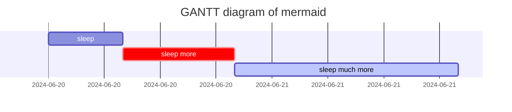
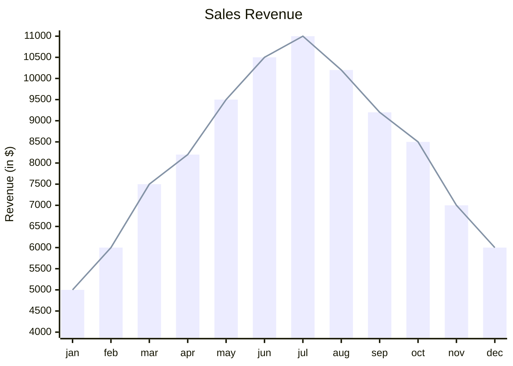
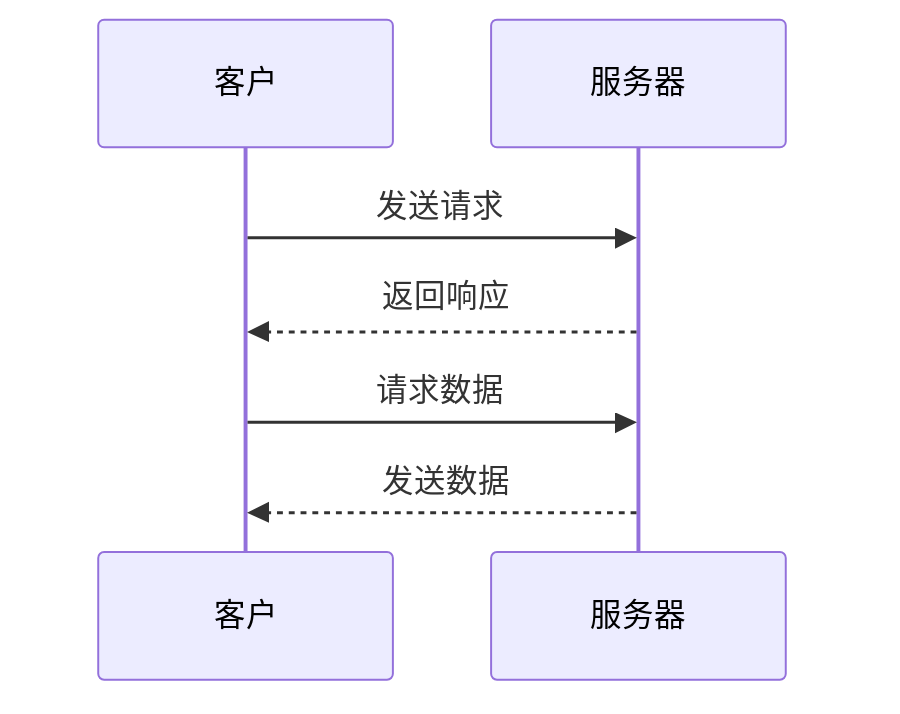

## Headings

<!-- markdownlint-capture -->
<!-- markdownlint-disable -->
# H1 — heading
{: .mt-4 .mb-0 }

## H2 — heading
{: data-toc-skip='' .mt-2 .mb-2 }

### H3 — heading
{: data-toc-skip='' .mt-3 .mb-4 }

#### H4 — heading
{: data-toc-skip='' .mt-4 .mb-6 }
<!-- markdownlint-restore -->

## Four kinds of prompts 

<!-- markdownlint-capture --> 
<!-- markdownlint-disable -->

> An example showing the `tip` type prompt.
{: .prompt-tip }

> An example showing the `info` type prompt.
{: .prompt-info }

> An example showing the `warning` type prompt.
{: .prompt-warning }

> An example showing the `danger` type prompt.
{: .prompt-danger }
<!-- markdownlint-restore -->

## Code blocks

### Inline code

This is an example of `Inline Code`.

### Common

```text
This is a common code snippet, without syntax highlight and line number.
```

### Specific Language

```bash
if [ $? -ne 0 ]; then
  echo "The command was not successful.";
  #exit
fi;
```

### Specific filename

```sass
@import 'addon/commons';
```
{: file='_sass/main.scss'}

### Jekyll Liquid Codes

```liquid

  This product's title contains the word Pack.

```


## Math powered by [**MathJax**](https://www.mathjax.org/)

<!-- Inline math in lines, NO blank lines -->

"Lorem ipsum dolor sit amet, $$ LaTeX math expression $$ consectetur adipiscing elit."

<!-- Inline math in lists, escape the first `$` -->

1. \$$ LaTeX math expression $$
2. \$$ LaTeX math expression $$

$$
\begin{equation}
  \sum_{n=1}^\infty 1/n^2 = \frac{\pi^2}{6}
  \label{eq:series}
\end{equation}
$$

We can reference the equation as \eqref{eq:series}.

When $a \ne 0$, there are two solutions to $ax^2 + bx + c = 0$ and they are

$$ x = {-b \pm \sqrt{b^2-4ac} \over 2a} $$

## Video 

### Bilibili



### Youtube and so on



## Audio


## Image

### Image with specific width and height

{: width="250" height="250" }
_a caption for photo: killua_

### Left aligned image

<!-- .normal 起到的左对齐效果 -->
{: width="150" height="150" .w-70 .h-70 .normal} text in the right

text below

### Float to left

{: width="200" height="200" .w-70 .left}
ramdom text for showing the effect of float: Praesent maximus aliquam sapien. Sed vel neque in dolor pulvinar auctor. Maecenas pharetra, sem sit amet interdum posuere, tellus lacus eleifend magna, ac lobortis felis ipsum id sapien. Proin ornare rutrum metus, ac convallis diam volutpat sit amet. Phasellus volutpat, elit sit amet tincidunt mollis, felis mi scelerisque mauris, ut facilisis leo magna accumsan sapien. In rutrum vehicula nisl eget tempor. Nullam maximus ullamcorper libero non maximus. Integer ultricies velit id convallis varius. Praesent eu nisl eu urna finibus ultrices id nec ex. Mauris ac mattis quam. Fusce aliquam est nec sapien bibendum, vitae malesuada ligula condimentum.

### Dark/Light mode & Shadow

The image below will toggle dark/light mode based on theme preference, notice it has shadows.

<!-- .rounded-10 用于设置元素的圆角效果 -->
{: .light .w-20 .shadow .rounded-10 w='200' h='200' }
{: .dark .w-20 .shadow .rounded-10 w='200' h='200' }


## Graphs supported by [Mermaid](https://mermaid.js.org/intro/getting-started.html)







## Lists

### Ordered list

1. Firstly
2. Secondly
3. Thirdly

### Unordered list

- Chapter
  - Page
    - Paragraph

### ToDo list

- [ ] Job
  - [x] Step 1

### Description list

Sun
: the star around which the earth orbits

## Quote and bold and italic

> This line shows the __block quote__ and _block quote_.

## Filepath

Here is the `/path/to/the/file.extend`{: .filepath}.

## Links

[B站](https://www.bilibili.com)

<https://www.bilibili.com>

## Tables

| Company                      | Contact          | Country |
| :--------------------------- | :--------------- | ------: |
| Alfreds Futterkiste          | Maria Anders     | Germany |
| Island Trading               | Helen Bennett    |      UK |

## Footnote

Click the hook will locate the footnote[^footnote], and here is another footnote[^fn-nth-2].

[^footnote]: The footnote source
[^fn-nth-2]: The 2nd footnote source


